# RevoShop — Next.js E-Commerce (Module 5)

**GitHub Repository:** https://github.com/Revou-FSSE-Oct25/milestone-3-liaro25
**Live Demo:** https://module5-8eoj.vercel.app/  
**Development Notes (Notion):** https://noto.li/NXX6yr

---

## Overview

RevoShop implements a complete e-commerce workflow, including:

- Product listing & product detail pages
- Shopping cart with persistence
- Authentication & role-based access control (RBAC)
- Admin dashboard with full CRUD functionality
- API Routes using the App Router
- Secure route protection using middleware
- Dynamic rendering & server-side data fetching

The main goal of this project is to showcase **modern Next.js full-stack patterns** using the App Router.

---

## Features

### Product Management

- Product listing page
- Product detail page using dynamic route segments
- Server-side data fetching
- Client-side category filtering
- Price sorting (Low → High / High → Low)
- Real-time UI update without page reload

### Shopping Cart

- Add & remove products from cart
- Cart state persisted using `localStorage`
- Cart summary & checkout flow
- Temporary "Added ✓" feedback to prevent double clicks
- Integration-tested cart flow

### Authentication & Authorization

- Login authentication via external API
- Session management
- Role-based access control (Admin vs User)
- Protected routes using Next.js Middleware

### Admin Dashboard

- Admin-only access
- Full CRUD operations:
  - Create product
  - Read product list
  - Update product
  - Delete product
- API Routes implemented using App Router route handlers

### Technical Highlights

- Server Components vs Client Components
- Dynamic Route Segments (`[id]`)
- API Route Handlers (`app/api`)
- Server Actions
- Middleware for route protection
- Proper error handling & validation
- Modular and scalable project structure

---

### Incremental Static Regeneration (ISR)

- Implemented on `/news` route
- Uses revalidation strategy for performance optimization
- Demonstrates static generation with background regeneration

## Concepts Demonstrated

This project demonstrates the following **advanced Next.js concepts**:

- App Router architecture
- Server vs Client Components
- Dynamic routing
- API route handlers
- Role-based authorization
- State management strategies
- Server Actions
- Secure authentication flow
- Error handling best practices

## Testing Strategy

Testing implemented using:

- Jest
- React Testing Library
- JSDOM environment

### Unit Tests

Located in:
`src/__tests__`

Coverage includes:

- Cart reducer logic
- Authentication utilities
- API route handlers
- UI components (AddToCart, LoginForm, ProductCard, LogoutButton)
- Middleware validation

### Integration Tests

Includes:

- Cart flow integration
- Route protection validation

Run tests:

```ts
npm run test
```

## Tech Stack

| Category         | Technology                      |
| ---------------- | ------------------------------- |
| Framework        | Next.js (App Router)            |
| Language         | TypeScript                      |
| Styling          | Tailwind CSS                    |
| State Management | React Context + useReducer      |
| Data Fetching    | Axios                           |
| Authentication   | Server Actions + Cookie Session |
| Middleware       | Next.js Middleware              |
| Persistence      | localStorage + cookies          |
| Deployment       | Vercel                          |
| External API     | Platzi Fake Store API           |

---

## Routes & Access Control

| Route                       | Access            | Description                                               |
| --------------------------- | ----------------- | --------------------------------------------------------- |
| `/`                         | Public            | Landing page (redirects to `/dashboard` if authenticated) |
| `/login`                    | Public            | Authentication page                                       |
| `/products`                 | Public            | Product listing page                                      |
| `/products/[id]`            | Public            | Product detail page                                       |
| `/cart`                     | Public            | Shopping cart                                             |
| `/checkout`                 | Protected         | Checkout page (authentication required)                   |
| `/dashboard`                | Protected         | User dashboard                                            |
| `/admin`                    | Protected (Admin) | Admin dashboard                                           |
| `/admin/products`           | Protected (Admin) | Product management table                                  |
| `/admin/products/new`       | Protected (Admin) | Create new product                                        |
| `/admin/products/[id]/edit` | Protected (Admin) | Edit product                                              |
| `/faq`                      | Public            | Frequently Asked Question (demo to show SSG)              |
| `/news`                     | Public            | News (demo to show ISR page)                              |

---

## 🏗 Application Architecture

### 1️⃣ Routing & Access Control

#### Landing Page (`/`)

- Implemented as a **Server Component**
- Automatically redirects authenticated users to `/dashboard`

---

#### Public Catalog

Routes:

- `/products`
- `/products/[id]`

Features:

- Dynamic route segments
- Data fetched via internal API routes
- Interactive UI components

---

#### Protected Routes

Protected via **Next.js Middleware**:

- `/checkout`
- `/dashboard`
- `/admin`
- `/admin/products`
- `/admin/products/new`
- `/admin/products/[id]/edit`

Middleware responsibilities:

- Session validation
- Redirect unauthenticated users to `/login`
- Enforce admin role for `/admin` routes

---

### 2️⃣ Authentication & Authorization Flow

- Login implemented using **Server Actions**
- Authentication handled via external API
- Session stored in **HTTP-only cookies**
- Middleware validates:
  - Authentication state
  - Role-based access (admin)
- `/api/me` route provides client-accessible user session info
- Unauthorized access results in secure redirection

---

### 3️⃣ Shopping Cart Flow

Cart implementation:

- **React Context API**
- `useReducer` for predictable state transitions
- Cart data persisted in **localStorage**

Cart state is shared across:

- Product listing page
- Product detail page
- Cart page
- Checkout page

Cart remains:

- Fully client-side
- Independent from authentication system

---

### 4️⃣ Admin CRUD Architecture

Admin product management uses:

#### API Routes (App Router)

| Endpoint             | Method | Description                 | Access    |
| -------------------- | ------ | --------------------------- | --------- |
| `/api/products`      | GET    | Fetch products              | Public    |
| `/api/products`      | POST   | Create product              | Admin     |
| `/api/products/[id]` | GET    | Fetch single product        | Public    |
| `/api/products/[id]` | PUT    | Update product              | Admin     |
| `/api/products/[id]` | DELETE | Delete product              | Admin     |
| `/api/me`            | GET    | Get authenticated user info | Protected |

---

#### Admin UI Flow

- `/admin/products` → Server-side fetch product table
- `/admin/products/new` → Client-side form submission (POST)
- `/admin/products/[id]/edit` →
  - Server-side product fetch
  - Client-side form submission (PUT)

---

#### Dynamic Route Handling (Next.js 16)

Handled new `params` Promise behavior:

```ts
type Ctx = { params: Promise<{ id: string }> };
const { id } = await params;
```

#### Server-side Internal API Calls

Used absolute URL for server components:

```
const baseUrl = `${protocol}://${host}`;
fetch(`${baseUrl}/api/products`)
```

## Project Structure

```txt
├── README.md
├── eslint.config.mjs
├── jest.config.ts
├── jest.setup.tsx
├── next-env.d.ts
├── next.config.ts
├── package-lock.json
├── package.json
├── postcss.config.mjs
├── public
│   ├── file.svg
│   ├── globe.svg
│   ├── images
│   │   └── placeholder.svg
│   ├── next.svg
│   ├── revoshoplogo.png
│   ├── vercel.svg
│   └── window.svg
├── src
│   ├── __tests__
│   │   ├── AddToCart.test.tsx
│   │   ├── CartContext.test.tsx
│   │   ├── LoginForm.test.tsx
│   │   ├── LogoutButton.test.tsx
│   │   ├── ProductCard.test.tsx
│   │   ├── api.products.test.ts
│   │   ├── auth.test.ts
│   │   ├── cart.integration.test.tsx
│   │   └── proxy.test.ts
│   ├── app
│   │   ├── actions
│   │   │   └── auth.ts
│   │   ├── admin
│   │   │   ├── page.tsx
│   │   │   └── products
│   │   │       ├── [id]
│   │   │       │   └── edit
│   │   │       │       └── page.tsx
│   │   │       ├── new
│   │   │       │   └── page.tsx
│   │   │       └── page.tsx
│   │   ├── api
│   │   │   ├── me
│   │   │   │   └── route.ts
│   │   │   ├── news
│   │   │   │   └── route.ts
│   │   │   └── products
│   │   │       ├── [id]
│   │   │       │   └── route.ts
│   │   │       └── route.ts
│   │   ├── cart
│   │   │   └── page.tsx
│   │   ├── checkout
│   │   │   └── page.tsx
│   │   ├── dashboard
│   │   │   └── page.tsx
│   │   ├── faq
│   │   │   └── page.tsx
│   │   ├── favicon.ico
│   │   ├── globals.css
│   │   ├── layout.tsx
│   │   ├── login
│   │   │   └── page.tsx
│   │   ├── news
│   │   │   └── page.tsx
│   │   ├── page.tsx
│   │   ├── products
│   │   │   ├── [id]
│   │   │   │   └── page.tsx
│   │   │   └── page.tsx
│   │   └── ui
│   │       ├── button.tsx
│   │       ├── login-form.tsx
│   │       └── logout-button.tsx
│   ├── cart
│   │   └── page.tsx
│   ├── components
│   │   ├── AddToCart.tsx
│   │   ├── Footer.tsx
│   │   ├── Header.tsx
│   │   ├── ProductCard.tsx
│   │   ├── ProductGrid.tsx
│   │   └── admin
│   │       ├── ProductForm.tsx
│   │       └── ProductTable.tsx
│   ├── context
│   │   └── CartContext.tsx
│   ├── lib
│   │   ├── api.ts
│   │   ├── dal.ts
│   │   ├── definitions.ts
│   │   ├── session.ts
│   │   └── utils.ts
│   ├── proxy.ts
│   └── types
│       └── product.ts
└── tsconfig.json
```

## Screenshots

### Homepage

Landing page with navigation options:

- Browse Products
- Login
- News
- Redirects authenticated users to `/dashboard`
  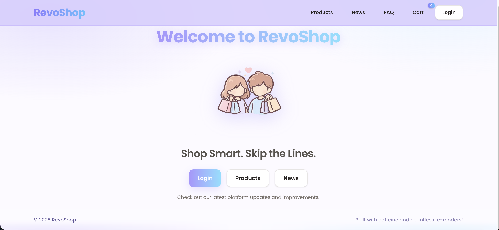

---

### Product Listing

Displays product grid with dynamic data fetching.  
Route: `/products`
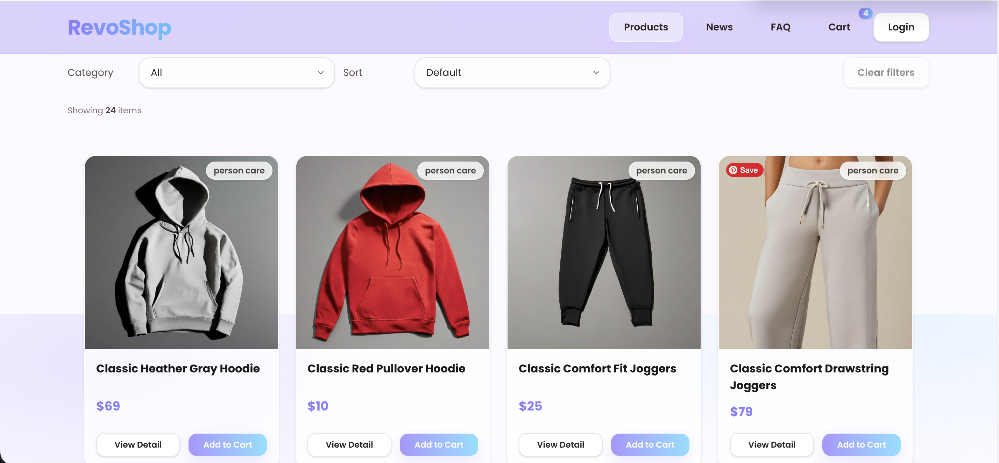

---

### Product Detail

Dynamic route using App Router.  
Route: `/products/[id]`
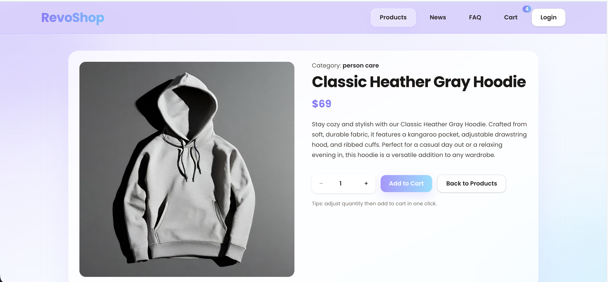

### Cart Page

Cart state managed with Context API and persisted via localStorage.
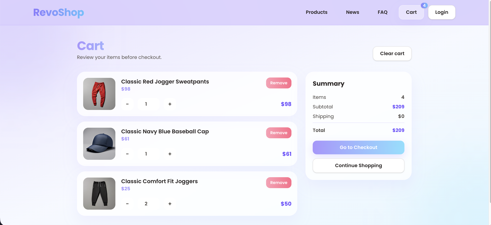

---

### Login Page

Authentication using API route and cookie-based session.
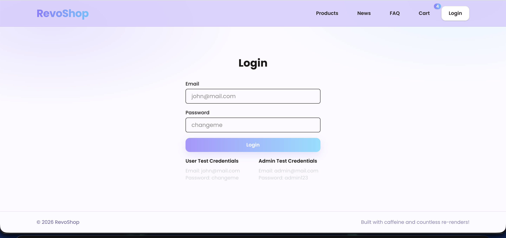

---

### Dashboard

Displays authenticated user information and role-based actions.
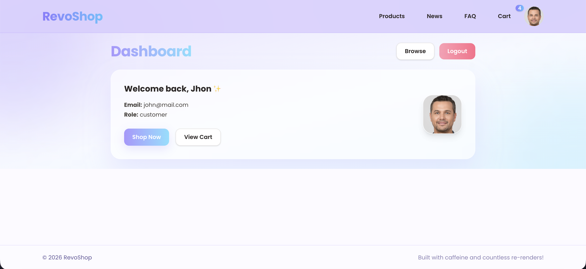
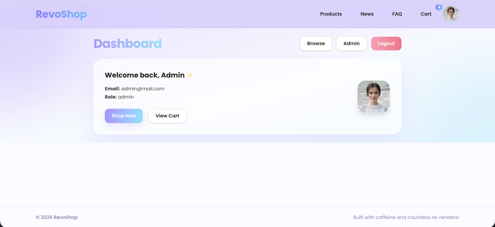

---

### Admin Panel

Protected via middleware and server-side role validation.
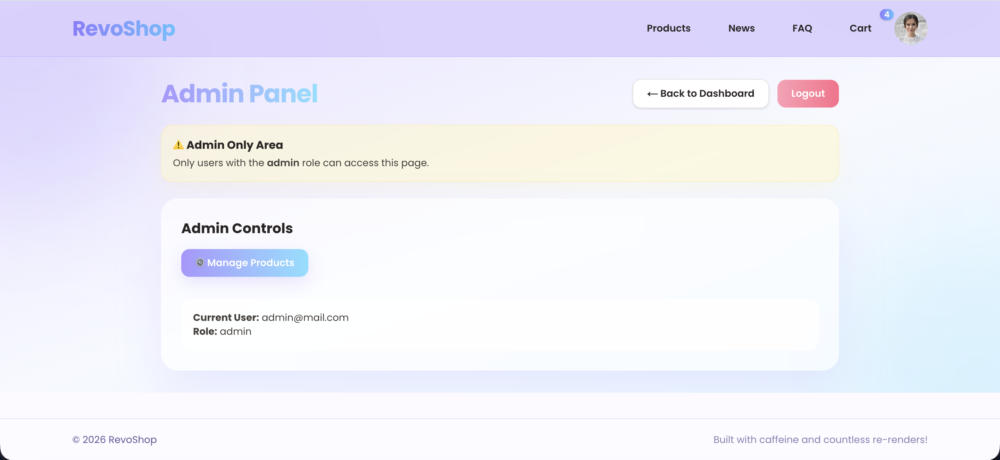

---

### Admin — Products (CRUD)

Full CRUD implementation:

- Create
- Edit
- Delete
- Server-side fetching
- Dynamic API routes
  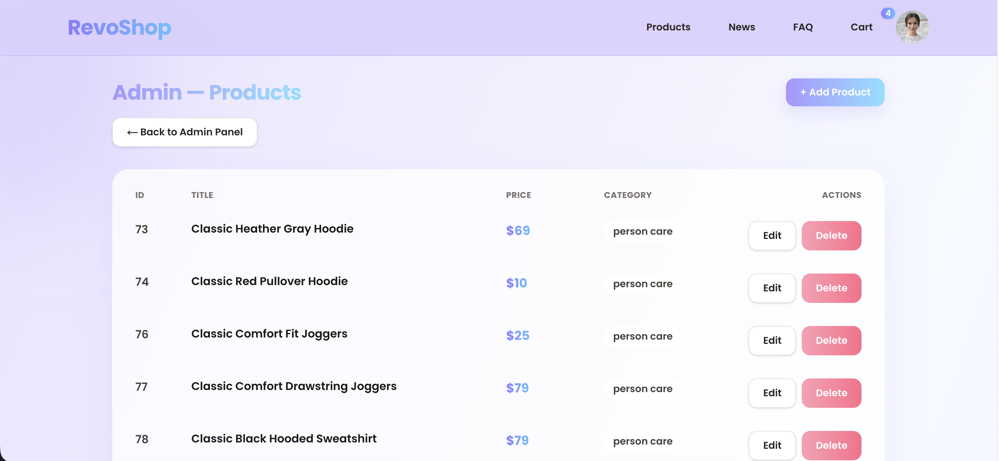

---

### Edit Product

- Server Component fetching product data
- Client Component form submission

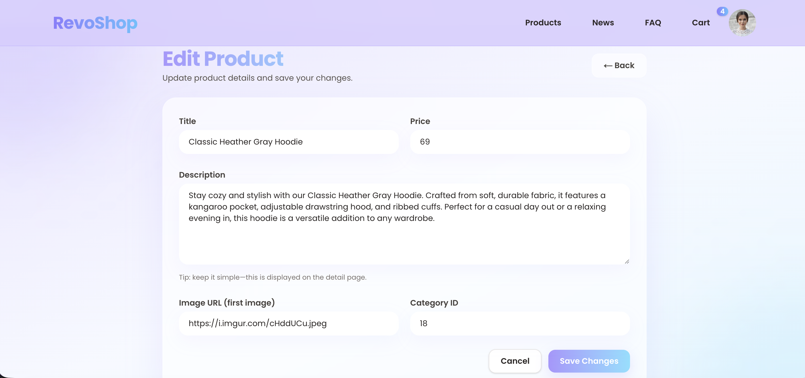

---

### News (ISR Page)

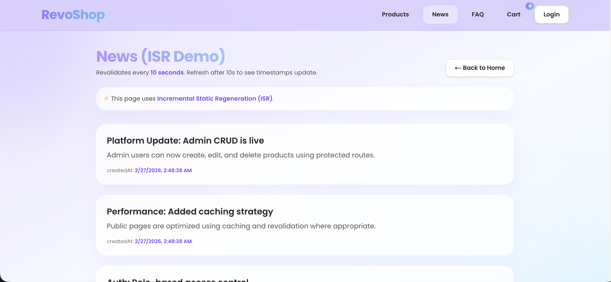

---

### FAQ Page

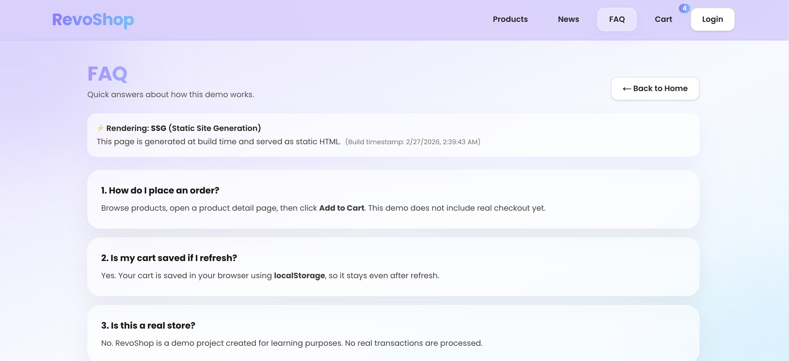
